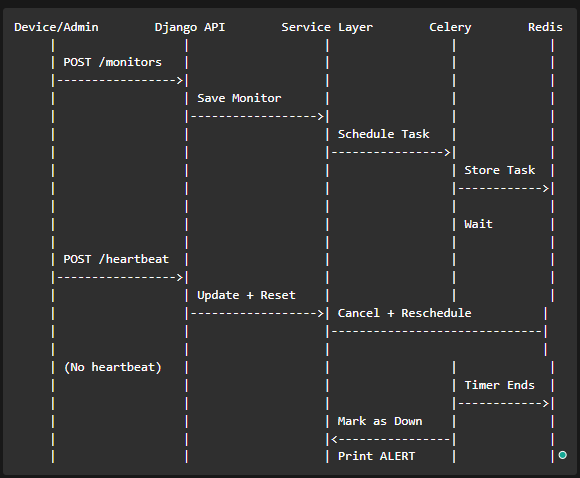

# Pulse Check - Dead Man’s Switch API

## Overview

Pulse Check is a backend monitoring API designed to track remote devices such as solar farms and weather stations.

Each device registers a monitor with a timeout. If the device fails to send a heartbeat before the timeout expires, the system automatically marks it as **down** and triggers an alert.

---

# 1. Architecture Diagram

```
Client (Device / Admin)
        |
        v
Django REST API (ViewSet)
        |
        v
Service Layer (Business Logic)
   |                |
   v                v
Database        Celery Worker
(Monitor, Logs)     |
                    v
                 Redis
                    |
                    v
               Alert System
```

### System Flow

```
Create Monitor → Schedule Timer → Wait
Heartbeat → Reset Timer
No Heartbeat → Timer Ends → Mark Down → Alert
```

---

# 2. Setup Instructions

## Requirements

- Python 3.10+
- Docker installed
- Git installed

---

## Clone Project

```
git clone https://github.com/uncletoon/AmaliTech-DEG-Project-based-challenges.git
cd backend/pulse-check
use branch: dev-branch
```

---

## Run Entire System with Docker

```
docker compose up --build
```

This will start:

- Django API (`web`)
- Celery worker (`celery`)
- Redis (`redis`)

---

## Run Django Commands (Inside Docker)

### Migrations

```
docker compose exec web python manage.py makemigrations
docker compose exec web python manage.py migrate
```

### Create Superuser (optional)

```
docker compose exec web python manage.py createsuperuser
```

---

## Access API

```
http://127.0.0.1:8000/
```

---

## View Logs

### Celery Logs

```
docker compose logs -f celery
```

### Django Logs

```
docker compose logs -f web
```

---

## Stop Containers

```
docker compose down
```

---

# 3. API Documentation

## 🔹 Create Monitor

```
POST /monitors/
```

### Body

```
{
  "id": "device-123",
  "timeout": 60,
  "alert_email": "admin@test.com"
}
```

---

## 🔹 Send Heartbeat

```
POST /monitors/{id}/heartbeat/
```

Resets the countdown timer.

---

## 🔹 Pause Monitor

```
POST /monitors/{id}/pause/
```

Stops monitoring temporarily.

---

## 🔹 Get Heartbeat History

```
GET /monitors/{id}/heartbeats/
```

### Example Response

```
[
  {
    "monitor": "device-123",
    "timestamp": "2026-04-27T10:30:00Z",
    "status_before": "active",
    "note": "Heartbeat received"
  }
]
```

---

## 🚨 Alert Behavior

If no heartbeat is received before timeout:

```
{
  "ALERT": "Device device-123 is down!",
  "time": "timestamp"
}
```

Status becomes:

```
down
```

---

## API Sequence Diagram

## 

# 4. Developer’s Choice

## 🔹 Feature 1: Heartbeat History Logging

### ✔ What it does

- Stores every heartbeat event in the database
- Tracks when devices were active
- Records previous status before each heartbeat

### ✔ Why it is important

This feature adds **observability and debugging capability**:

- Helps verify whether a device actually stopped sending signals
- Allows engineers to investigate missed alerts
- Provides historical data for monitoring patterns

👉 Without this, the system only knows "down" but not _why_.

---

## 🔹 Feature 2: Full Docker Containerization

### ✔ What it does

- Runs Django, Celery, and Redis inside containers
- Ensures consistent environment across machines

### ✔ Why it is important

This improves **deployment and collaboration**:

- Eliminates "it works on my machine" problems
- Simplifies setup for new developers
- Makes the system production-ready

👉 Running everything in Docker ensures the system behaves the same everywhere.

---

## 🎯 Final Value

These enhancements make the system:

- More reliable (Celery + Redis)
- More debuggable (Heartbeat Logs)
- More scalable (Containerized services)

---

## 👨‍💻 Author

Patience INGABIRE TUYISENGE
